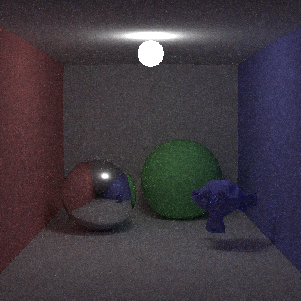
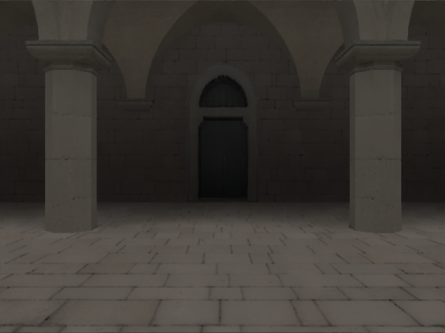

# aten

This is easy, simple ray tracing renderer. 
Aten is Egyptian sun god.

Idaten(path tracing on GPGPU) is under construction. 
Idaten is Japanese god, it runs fast.
And Idanten includes characters of aten, "id**aten**"

## Features

- Rendering algorithms
  - Ray Tracing
  - Next Event Estimation Path Tracing
  - Bi-Directional Path Tracing
  - Primary Sample Space Metropolis Light Transport
  - Energy Re-distribution Path Tracing
  - AOV
    - albedo, depth, normal, geometry id.
- Acceralation
  - BVH
  - SBVH
  - TopLayer, BottomLayer
  - Transform(Translate, Rotate, Scale) objects
- Materials
  - Emissive
  - Lambert
  - Specular
  - Refraction
  - Microfacet Blinn
  - Microfacet Beckman
  - Microfacet GGX
  - Disney BRDF
  - Car Paint (Experimental)
  - Toon(Non Photoreal)
  - Layer
- Lights
  - Polygonal Light(Area Light)
  - Point Light
  - Spot Light
  - Directional Light
  - Image Based Lighting
- Quasi Monte Carlo
  - Halton
  - Sobol
  - CMJ(Correllated Multi Jittered)
- Rendering shapes
  - Polygon(.obj file)
  - Sphere
  - Cube
- Texture Map
  - Albedo
  - Normal
  - Roughness
- Denoise filter
  - Non Local Mean
  - Birateral
  - Practical Noise Reduction for Progressive Stochastic Ray Tracing with Perceptual Control
  - Robust Image Denoising using a Virtual Flash Image for Monte Carlo Ray Tracing
  - [Spatiotemporal Variance-Guided Filtering: Real-Time Reconstruction for Path-Traced Global Illumination](https://cg.ivd.kit.edu/svgf.php)
- PostEffect
  - Simple Bloom
  - Reinherd Tone Mapping
- Cameras
  - Pinhole
  - Thin Lens(DoF)
  - 360 view
- Others
  - Instancing
  - Scene Definition by XML
  - Deformation

## Limitations
  
- Not optimisation by SIMD
  - This should be easy, simple, to avoid difficult to understand, so not use SIMD.
- Bi-Directional Path Tracing
  - Only Area Light
- Scene Definition by XML
  - Can not specify all definitions.
- Not support texture alpha yet.
- There are some Japanese comments...

## Under Construction Works

- More efficient denoise filter
  - [Gradient Estimation for Real-Time Adaptive Temporal Filtering](https://cg.ivd.kit.edu/atf.php)

## Future Works

- Specify all scene definitions by XML
- Bi-Directional Path Tracing
  - Enable to use all lights
- Sub Surface Scattering
- Particiate Media
- Rendering algorithms
  - Photon mapping
  - Progressive Photom mapping
  - VCM
- More efficient acceleration algorithms

## How To Build

### Windows

1. Install `CUDA 10.1` and depended NVIDIA driver
2. Run `aten/3rdparty/Build3rdParty.bat <Debug|Release>`
3. Launch `aten/vs2019/aten.sln`
4. Build porjects with `x64` (not support `x86`)

I confirmed with Visual Studio 2019 on Windows10.

Supoort just only `CUDA 10.1`.

### Linux

1. Install `CUDA 10.1` or later and depended NVIDIA driver
2. Install applications (You can find what you need in `Dockerfile`)
    * Install `cmake` `3.10.0` or later
    * Install `clang 8.0.0`
    * Install `ninja-build`
3. `cd aten/build`
4. `./RunCMake.sh`
5. Run make `ninja`

I confirmed on Ubuntu16.04 LTS and 18.04 LTS.

#### Docker

You can build and run executable aten application on Docker container.

1. Install `Docker` and `docker-compose`
2. Install [nvidia-docker2](https://github.com/NVIDIA/nvidia-docker).
3. Build docker image `docker-compose build`
4. Run docker container `docker-compose run aten`
5. `cd aten/build`
6. `./RunCMake.sh`
7. Run make `ninja`

If you would like to run built applications in docker, you need to ensure that your host can accept X forwarded connections `xhost +local:aten_aten`

## Gallery

PathTracing 100spp

Materials PathTracing 100spp

Bi-Directional PathTracing 100spp

PSSMLT 10spp 10mlt 10mutation

GPGPU 1spp

Deformation

(c) Unity Technologies Japan/UCL
