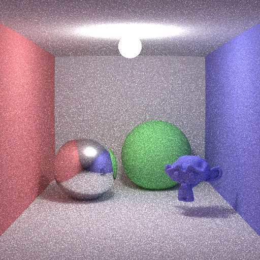
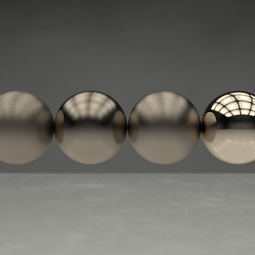
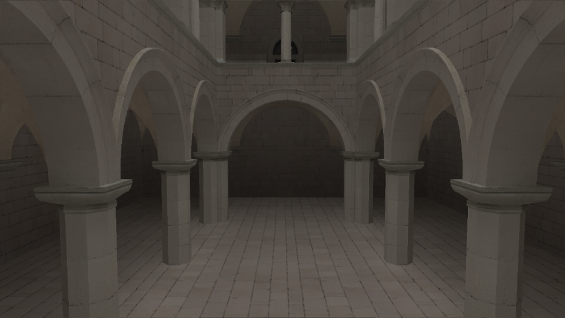
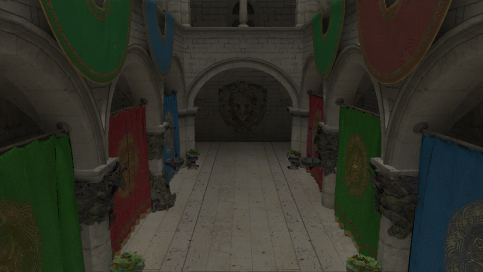
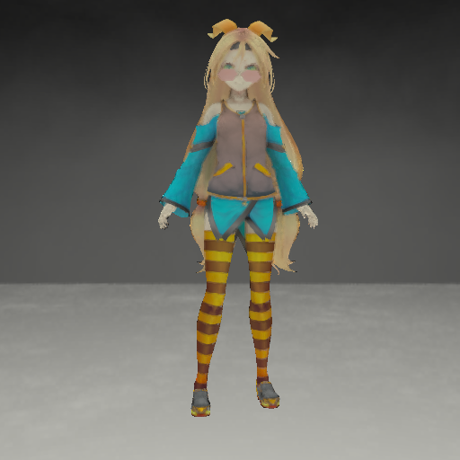
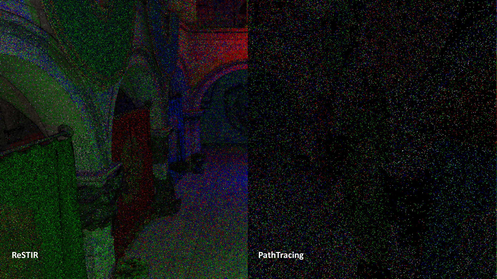
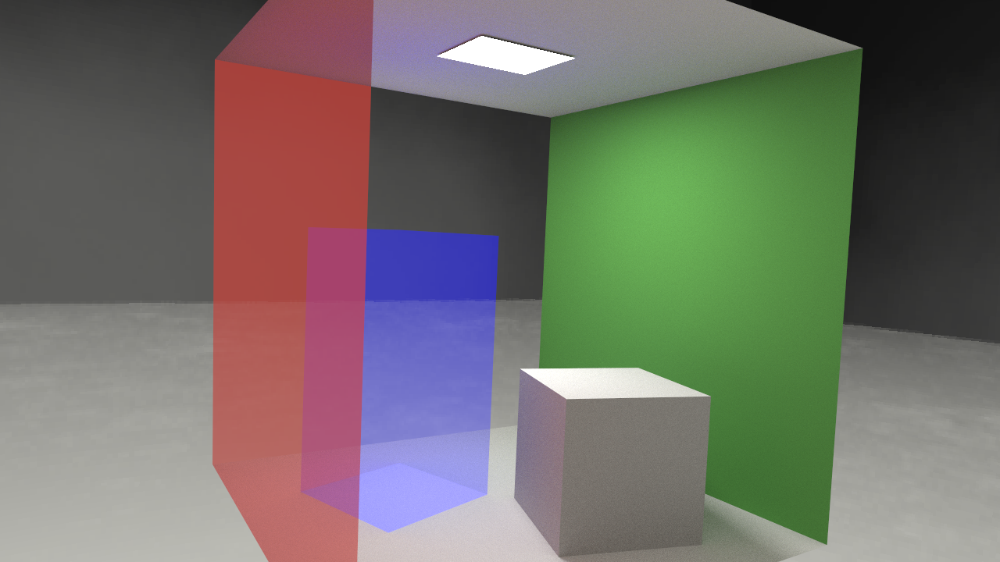
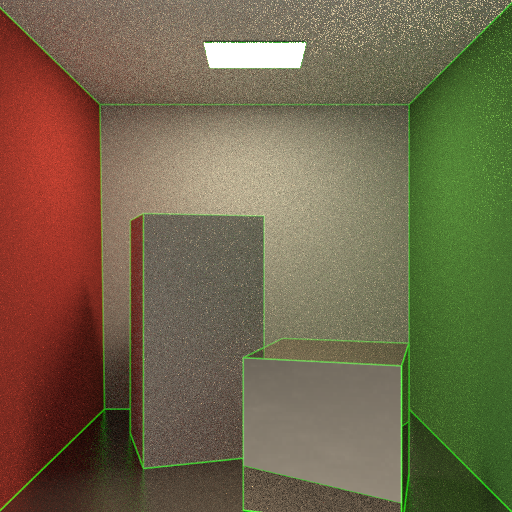
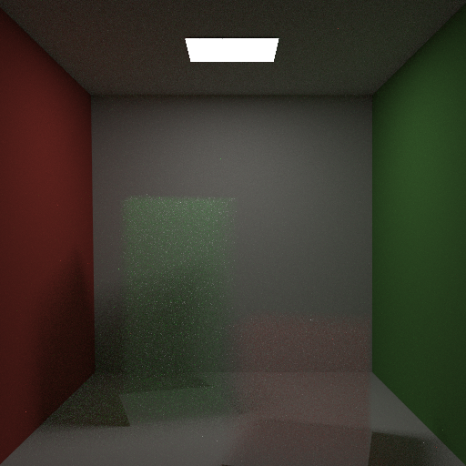
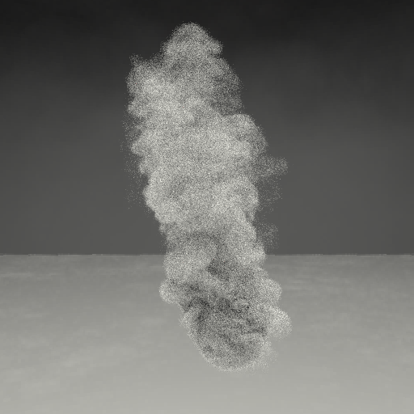

<!-- markdownlint-disable MD024 MD029 MD033 -->
# aten

This is easy, simple ray tracing renderer.

Aten is Egyptian sun god.

Idaten(path tracing on GPGPU) is under construction.

Idaten is Japanese god, it runs fast.
And Idanten includes characters of aten, "id**aten**"

## Features

**Some features are only supported by either.**

- Rendering algorithms
  - Next Event Estimation Path Tracing
- Acceleration
  - BVH
  - SBVH
  - TopLayer, BottomLayer
  - Transform(Translate, Rotate, Scale) objects
- Materials
  - Emissive
  - Lambert
  - Specular
  - Refraction
  - Microfacet Beckman
  - Microfacet GGX
  - OrenNayar
  - Disney BRDF
  - Retroreflective (Experimental)
- Lights
  - Polygonal Light(Area Light)
  - Point Light
  - Spot Light
  - Directional Light
  - Image Based Lighting
- Quasi Monte Carlo
  - CMJ(Correllated Multi Jittered)
- Rendering shapes
  - Polygon(.obj file)
  - Sphere
- Texture Map
  - Albedo
  - Normal
  - Roughness
- PostEffect
  - Reinherd Tone Mapping
- Camera
  - Pinhole
  - Equirect
- VolumeRendering
  - Homogeneous
  - Heterogeneous
  - NanoVDB format
- Others
  - Instancing
  - Deformation
  - Alpha blending
- [Spatiotemporal Variance-Guided Filtering: Real-Time Reconstruction for Path-Traced Global Illumination](https://cg.ivd.kit.edu/svgf.php)
- [Spatiotemporal reservoir resampling for real-time ray tracing
with dynamic direct lighting](https://research.nvidia.com/sites/default/files/pubs/2020-07_Spatiotemporal-reservoir-resampling/ReSTIR.pdf)
- [Physically-based Feature Line Rendering](http://lines.rexwe.st/)

## Limitations

- Not optimized by SIMD
  - To keep easy, simple, to avoid difficult to understand, so not use SIMD.
- There are still some Japanese comments...

## How To Build

[How To Build](docs/how_to_build.md)

## How to run

[How To Run](docs/how_to_run.md)

## For VSCode development

We can open this project on VSCode devcontainer.
If you face on devcontainer build failure, it might be due to docker-compose version. In that case,
please update docker-compose.

## Gallery

PathTracing 100spp

Materials PathTracing 100spp

SVGF (1spp/5bounds)

Deformation

(c) Unity Technologies Japan/UCL

ReSTIR (1spp/5bounds/126point lights w/o environment map)

AlphaBlending

Physically-based Feature Line Rendering

Homogeneous medium

Heterogeneous medium

## Misc

- Conventional Commits
  - <https://www.conventionalcommits.org/en/v1.0.0/>
