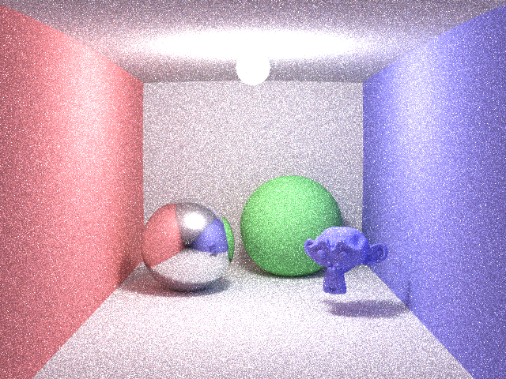
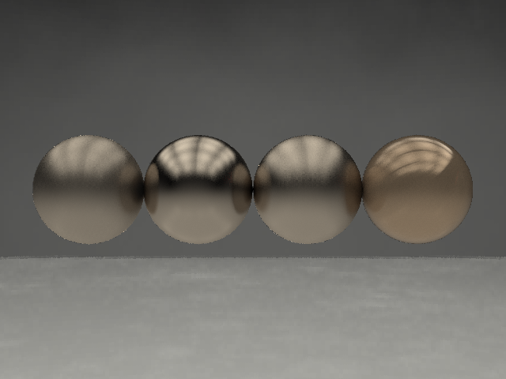
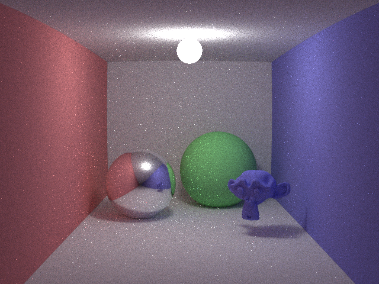
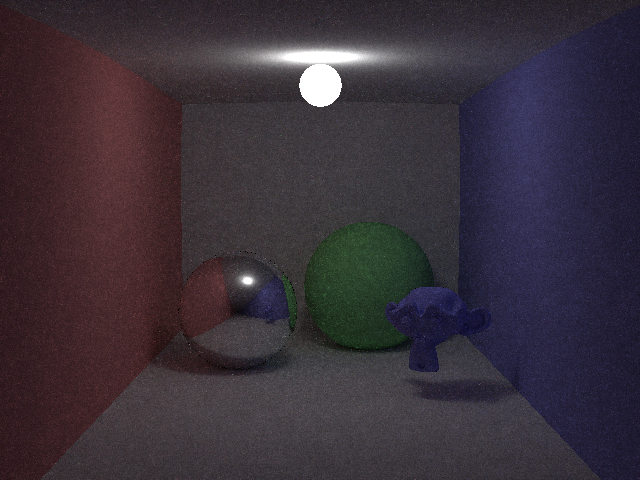
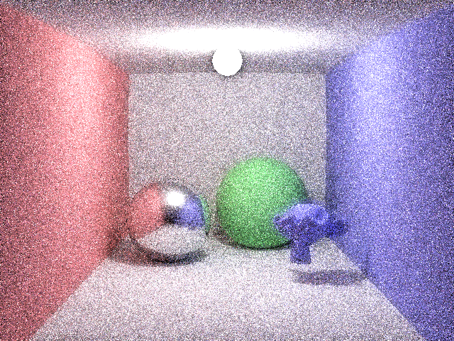

# aten

This is easy, simple path tracer. 
Aten is Egyptian sun god.

And, idaten(path tracing on GPGPU) is under construction. 
Idaten is Japanese god, it runs fast.

## Features

- Rendering algorithms
  - Ray Tracing
  - Next Event Estimation Path Tracing
  - Bi-Directional Path Tracing
  - Primary Sample Space Metropolis Light Transport
  - Energy Re-distribution Path Tracing
  - AOV
    - albedo, depth, normal, geometry id.
- Materials
  - Emissive
  - Lambert
  - Specular
  - Refraction
  - Microfacet Blinn
  - Microfacet Beckman
  - Microfacet GGX
  - Disney BRDF
  - Toon(Non Photoreal)
  - Layer
- Lights
  - Polygonal Light(Area Light)
  - Point Light
  - Spot Light
  - Directional Light
  - Image Based Lighting
- Quasi Monte Carlo
  - Halton
  - Sobol
- Rendering shapes
  - Polygon(.obj file)
  - Sphere
  - Cube
- Texture Map
  - Albedo
  - Normal
  - Roughness
- Denoise filter
  - Non Local Mean
  - Birateral
  - Practical Noise Reduction for Progressive Stochastic Ray Tracing with Perceptual Control
  - Robust Image Denoising using a Virtual Flash Image for Monte Carlo Ray Tracing
- PostEffect
  - Simple Bloom
  - Reinherd Tone Mapping
- Cameras
  - Pinhole
  - Thin Lens(DoF)
  - 360 view
- Others
  - Instancing
  - Scene Definition by XML

## Limitations
  
- Not optimisation by SIMD
  - This should be easy, simple, to avoid difficult to understand, so not use SIMD.
- Bi-Directional Path Tracing
  - Only Area Light
- Scene Definition by XML
  - Can not specify all definitions.
- Only for Windows.
  - Only for Visual Studio 2015.
- There are some Japanese comments...

## Under Construction Works

- GPGPU
  - idaten is GPGPU project.

## Future Works

- More efficient denoise filter
- Specify all scene definitions by XML
- Bi-Directional Path Tracing
  - Enable to use all lights
- Sub Surface Scattering
- Particiate Media
- Rendering algorithms
  - Photon mapping
  - Progressive Photom mapping
  - VCM
- More efficient acceleration algorithms

## How To Build

1. Run `aten/3rdparty/Build3rdParty.bat`
2. Launch `aten/vs2015/aten.sln`
3. Build porjects

## Gallery

PathTracing 100spp

Materials PathTracing 100spp

Bi-Directional PathTracing 100spp

PSSMLT 10spp 100mlt 100mutation

ERPT 10spp 10mutation

