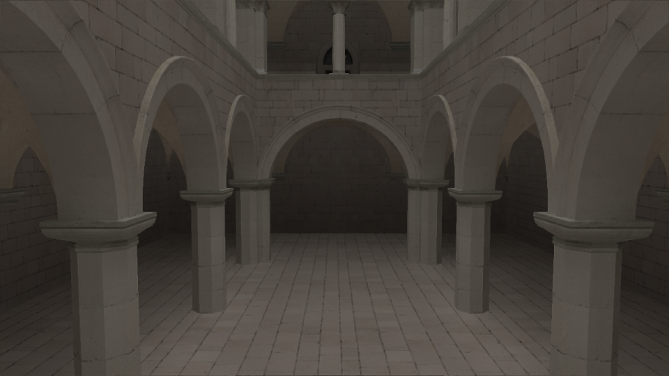
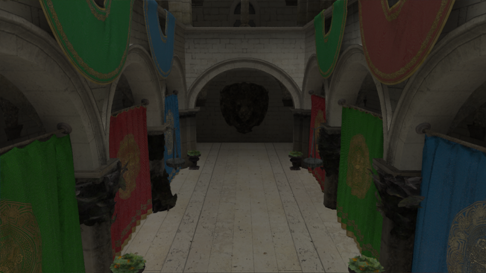
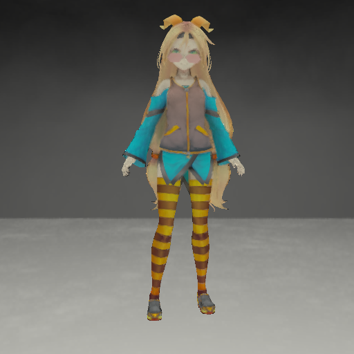
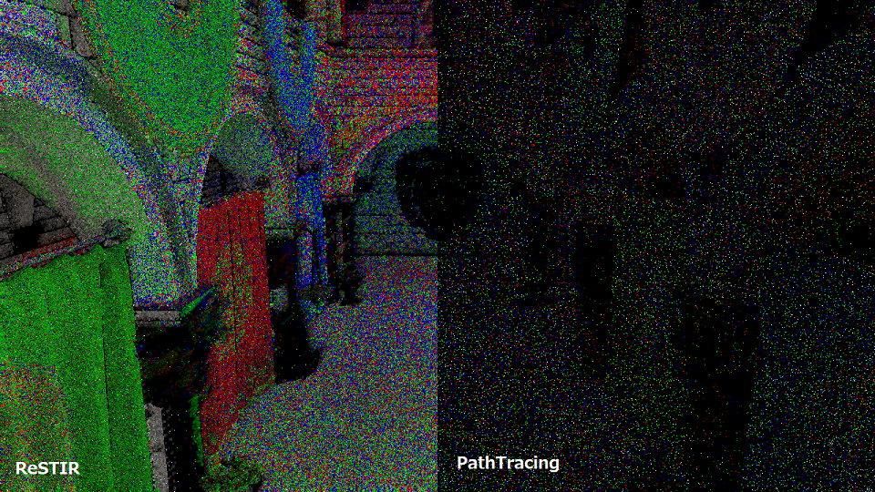
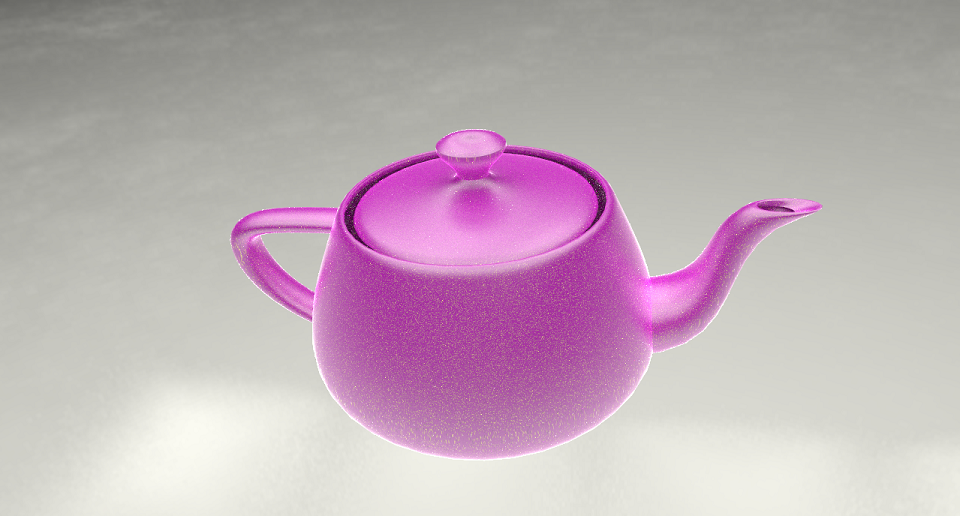
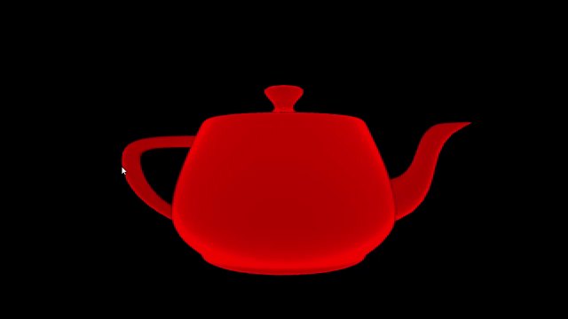
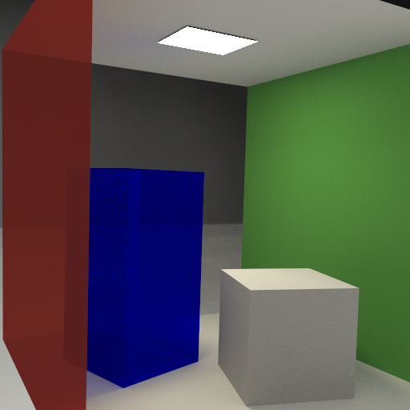
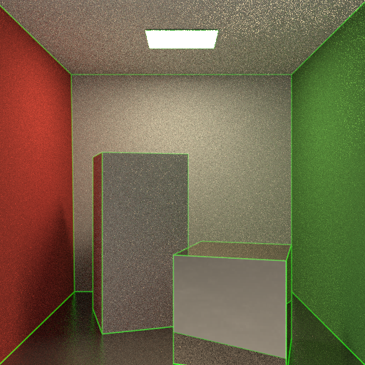

# aten


This is easy, simple ray tracing renderer.

Aten is Egyptian sun god.

Idaten(path tracing on GPGPU) is under construction.

Idaten is Japanese god, it runs fast.
And Idanten includes characters of aten, "id**aten**"

## Features

**Some features are only supported by either.**

- Rendering algorithms
  - Next Event Estimation Path Tracing
- Acceralation
  - BVH
  - SBVH
  - TopLayer, BottomLayer
  - Transform(Translate, Rotate, Scale) objects
- Materials
  - Emissive
  - Lambert
  - Specular
  - Refraction
  - Microfacet Blinn
  - Microfacet Beckman
  - Microfacet GGX
  - OrenNayar
  - Disney BRDF
  - CarPaint (Experimental)
  - Retroreflective (Experimental)
- Lights
  - Polygonal Light(Area Light)
  - Point Light
  - Spot Light
  - Directional Light
  - Image Based Lighting
- Quasi Monte Carlo
  - Halton
  - Sobol
  - CMJ(Correllated Multi Jittered)
- Rendering shapes
  - Polygon(.obj file)
  - Sphere
- Texture Map
  - Albedo
  - Normal
  - Roughness
- Denoise filter
  - Non Local Mean
- PostEffect
  - Simple Bloom
  - Reinherd Tone Mapping
- Camera
  - Pinhole
  - 360 view
- Others
  - Instancing
  - Deformation
  - Alpha blending
- [Spatiotemporal Variance-Guided Filtering: Real-Time Reconstruction for Path-Traced Global Illumination](https://cg.ivd.kit.edu/svgf.php)
- [Spatiotemporal reservoir resampling for real-time ray tracing
with dynamic direct lighting](https://research.nvidia.com/sites/default/files/pubs/2020-07_Spatiotemporal-reservoir-resampling/ReSTIR.pdf)
- [Physically-based Feature Line Rendering](http://lines.rexwe.st/)

## Limitations

- Not optimisation by SIMD
  - This should be easy, simple, to avoid difficult to understand, so not use SIMD.
- There are some Japanese comments...

## How To Build

### Prepearing

You also should get submodules in `3rdparty` directory.
To do that, follow as below:

```shell
git submodule update --init --recursive
```

### Windows

1. Install `CUDA 11.7` and depended NVIDIA driver
1. Run `aten/3rdparty/Build3rdParty.bat <Debug|Release>`
1. Launch `aten/vs2019/aten.sln`
1. Build porjects with `x64` (not support `x86`)

I confirmed with Visual Studio 2019 on Windows10.

Supoort just only `CUDA 11.7.0`.

### Linux

1. Install `CUDA 11.2.2` and depended NVIDIA driver
1. Install applications (You can find what you need in `env/aten/Dockerfile`)
    1. Install `cmake` `3.21.3` or later
    1. Install `clang 9.0.0`
    1. Install `ninja-build`
1. `cd aten/build`
1. `cp ../scripts/RunCMake.sh ./`
1. `./RunCMake.sh <Build Type> <Compute Capability>`
1. Run make `ninja`

I confirmed on 20.04 LTS.

#### What is RunCMake.sh

`RunCMake.sh` is a scirpt to help you to build `aten` with CMake.
It is located in `scripts` directory. If you would like to use it.
Copy it to the build directory you want.

It needs 2 arguments as below:

1. Build Type: `Debug` or `Release`
1. Compute Capability: It depends on your GPU. But, you need to specify it
without `.`. For example, if `Comnpute Capability` is `7.5`, please specify
like `75`.

Example to run `RunCMake.sh` is below:

```shell
./RunCMake.sh Release 75
```

You can get `Comnpute Capability` with running `get_cuda_sm.sh`.
If you don't specify `Comnpute Capability`, while configuring `CMakeLists.txt`,
`get_cuda_sm.sh` run and `Comnpute Capability` is specified.

### Docker (on Linux)

**Docker version is 20.10.9**

You can build and run executable aten application on Docker container.

1. Install `Docker`
2. Install [nvidia-docker2](https://github.com/NVIDIA/nvidia-docker).
3. Move to `aten` directory
4. Build docker image like the following:

```shell
docker build -t <Any name> ./env/aten/
```

5. Run docker container like the following:

```shell
docker run -it --rm -v ${PWD}:/work -v /tmp/.X11-unix:/tmp/.X11-unix:rw --runtime=nvidia -e DISPLAY <Image name>:latest bash
```

6. In the docker container, run the following commands:

```shell
mkdir aten/build
cd aten/build
cp ../scripts/RunCMake.sh .
./RunCMake.sh <Build Type> <Compute Capability>
ninja
```

##### docker-compose

**docker-compose version is v2.0.1**

1. Install `Docker` and `docker-compose`
2. Install [nvidia-docker2](https://github.com/NVIDIA/nvidia-docker).
3. Build docker image like the following:

```shell
docker-compose -f .devcontainer/docker-compose.yml build`
```

4. Run docker container like the following:

```shell
docker-compose .devcontainer/docker-compose.yml run aten
```

5. In the docker container, run the following commands:

```shell
mkdir aten/build
cd aten/build
cp ../scripts/RunCMake.sh .
./RunCMake.sh <Build Type> <Compute Capability>
ninja
```

## How to run

### Windows

Please find `exe` files and run them. You can find them in each directories
where source files are in.

### Linux

Please find execution files and run them. You can find them in the directories
in the directory which you built the applications. And the directories have
same name as execution file.

### Docker (on Linux)

If you would like to run built applications in docker, you need to ensure that
your host can accept X forwarded connections
`xhost +local:<Docker container name>`.

And, run docker container like below:

```shell
docker run -it --rm -v ${PWD}:/work -v /tmp/.X11-unix:/tmp/.X11-unix:rw --runtime=nvidia -e DISPLAY <Image Name>:latest bash
```

#### docker-compose

You also need to ensure your host as [Run on Docker](#Run-on-Docker).

And, run docker container via docker-compose like below:

```shell
docker-compose -f .devcontainer/docker-compose.yml run aten
```

## For VSCode development

You can open this project on VSCode devcontainer.
If you face on devcontainer build failure, it might be due to docker-compose version. In that case, please update docker-compose.

## Gallery

PathTracing 100spp


Materials PathTracing 100spp


SVGF (1spp/5bounds)




Deformation



(c) Unity Technologies Japan/UCL

ReSTIR (1spp/5bounds/126point lights w/o environment map)



CarPaint



Retroreflective



AlphaBlending



Physically-based Feature Line Rendering


